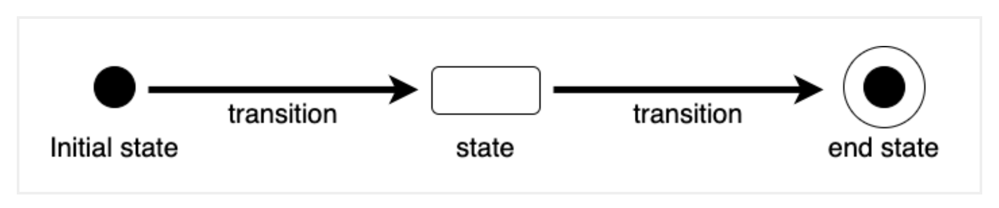
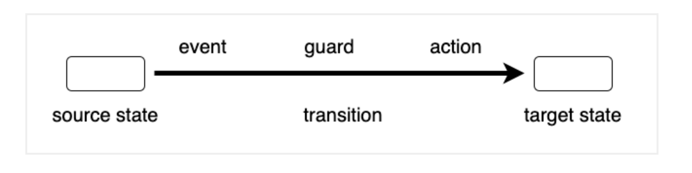

# State Diagram
하나의 객체를 대상으로 생존 기간 동안 가질 수 있는 객체 상태의 변화를 나타내는 다이어그램.
상태의 변화, 변화를 발생시키는 이벤트, 이벤트 후의 동작도 함께 정의하게 된다.

- Initial State: 초기 상태 값
- State: 상태 값
- Transition: 상태 전이
- End State: 완료 상태 값

## Transition

- Source State: 원래 상태
- Event: Transition을 발생시키는 사건
- Guard: Transition 발생 시 검토되는 Boolean 식(True 일때 Transition이 일어난다.)
- Action: Transition 발생 후 수행되는 행위
- Target State: 목표 상태

### 주의할 점
- Black Hole State를 주의할것.(상태는 in, ou에 대한 Transition이 모두 정의되어야 한다.)
- 일관성을 가지고 State Diagram을 구현할 것.
